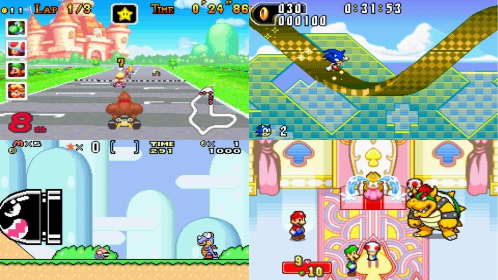

# Nintendo - Game Boy Advance (gpSP)

### Description

gpSP is a Game Boy Advance emulator based on notaz&apos;s fork of gpSP with additional codebase improvements.

### License

GPLv2

### Icon

### Fanart

Help make me fanart!

### Screenshots

